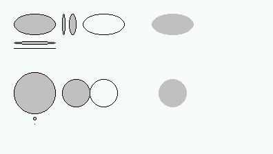
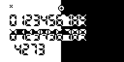
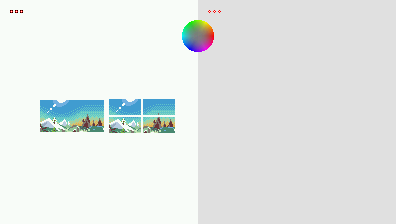

# `gint`: Wrapper for the gint library

PythonExtra is developed with the [fxSDK](https://gitea.planet-casio.com/Lephenixnoir/fxsdk) and uses the [gint kernel](https://gitea.planet-casio.com/Lephenixnoir/gint) as a runtime. The Python module `gint` provides access to gint's internal functions for rendering, keyboard, and more. Since gint has many versatile functions with good performance, it is beneficial to use it instead of e.g. `casioplot` or `turtle`.

The `gint` module tries to match its API with the original API of the C library, which is why few functions use keyword arguments or overloading. There are a few differences documented at the end of this document. For details not described in this document, one can refer to [gint's header files](https://gitea.planet-casio.com/Lephenixnoir/gint/src/branch/master/include/gint) which are always applicable unless this document explicitly says otherwise.

All constants, functions, etc. discussed here are in the `gint` module.

```py
import gint
# or:
from gint import *
```

**Contents**
- [Keyboard input](#keyboard-input)
- [Drawing and rendering](#drawing-and-rendering)
- [Differences with gint's C API](#differences-with-gints-c-api)

## Keyboard input

Reference headers: [`<gint/keyboard.h>`](https://gitea.planet-casio.com/Lephenixnoir/gint/src/branch/master/include/gint/keyboard.h) and [`<gint/keycodes.h>`](https://gitea.planet-casio.com/Lephenixnoir/gint/src/branch/master/include/gint/keycodes.h).

The module provides integer constants to refer to keyboard keys, with the following names:

|            |            |            |            |            |             |
|------------|------------|------------|------------|------------|-------------|
|`KEY_F1`    |`KEY_F2`    |`KEY_F3`    |`KEY_F4`    |`KEY_F5`    |`KEY_F6`     |
|`KEY_SHIFT` |`KEY_OPTN`  |`KEY_VARS`  |`KEY_MENU`  |`KEY_LEFT`  |`KEY_UP`     |
|`KEY_ALPHA` |`KEY_SQUARE`|`KEY_POWER` |`KEY_EXIT`  |`KEY_DOWN`  |`KEY_RIGHT`  |
|`KEY_XOT`   |`KEY_LOG`   |`KEY_LN`    |`KEY_SIN`   |`KEY_COS`   |`KEY_TAN`    |
|`KEY_FRAC`  |`KEY_FD`    |`KEY_LEFTP` |`KEY_RIGHTP`|`KEY_COMMA` |`KEY_ARROW`  |
|`KEY_7`     |`KEY_8`     |`KEY_9`     |`KEY_DEL`   |`KEY_ACON`  |             |
|`KEY_4`     |`KEY_5`     |`KEY_6`     |`KEY_MUL`   |`KEY_DIV`   |             |
|`KEY_1`     |`KEY_2`     |`KEY_3`     |`KEY_ADD`   |`KEY_SUB`   |             |
|`KEY_0`     |`KEY_DOT`   |`KEY_EXP`   |`KEY_NEG`   |`KEY_EXE`   |             |

### Keyboard events

```
key_event:
  .time  -> int
  .mod   -> bool
  .shift -> bool
  .alpha -> bool
  .type  -> KEYEV_NONE | KEYEV_DOWN | KEYEV_UP | KEYEV_HOLD
  .key   -> KEY_*
```

gint communicates information about keyboard activity through _events_. Events indicate when a key (`.key` field) is pressed, repeated or released (`.type` field equal to `KEYEV_DOWN`, `KEYEV_HOLD` and `KEYEV_UP` respectively), when (`.time` field), and whether modifiers (SHIFT, `.shift` field, and ALPHA, `.alpha` field) where active at that time.

(The `.mod` field isn't very interesting, and the `KEYEV_NONE` value for the `.type` field is discussed later with `pollevent()`.)

The functions `getkey()`, `getkey_opt()`, `pollevent()` and `waitevent()` all return events.

### Waiting for a key press

```py
getkey() -> key_event
```

The function `getkey()` pauses the program until a key is pressed or repeated, and returns the associated event (which is always of type `KEYEV_DOWN` or `KEYEV_HOLD`). By default, only arrow keys are repeated, once after 400 ms, then every 40 ms.

A few things can happen while `getkey()` is waiting. The user can press SHIFT or ALPHA which will trigger modifiers and affect the `.shift` and `.alpha` fields of the returned event. The user can also go to the main menu by pressing MENU or turn the calculator off with SHIFT+AC/ON.

_Example._ In a selection menu with N possible items, one could navigate with the up and down arrow keys, jump to the top or bottom with SHIFT up and SHIFT down, and validate with EXE.

```py
ev = getkey()
if ev.key == KEY_EXE:
    pass       # Validate
elif ev.key == KEY_UP and ev.shift:
    pos = 0    # Jump to top
elif ev.key == KEY_DOWN and ev.shift:
    pos = N-1  # Jump to bottom
elif ev.key == KEY_UP and pos > 0:
    pos -= 1   # Move one place up
elif ev.key == KEY_DOWN and pos < N-1:
    pos += 1   # Move one place down
```

TODO: Mention `getkey_opt()`

### Reading keyboard events in real time

```py
pollevent() -> key_event
waitevent() -> key_event
clearevents() -> None
```

gint records keyboard activity in the background while the program is running. Events are placed in a queue until the program reads them. This is how `getkey()` learns about keyboard activity, for example.

The `pollevent()` function provides direct access to events. `pollevent()` returns the oldest event that hasn't yet been read by the program. If there are no events waiting to be read, `pollevent()` returns a "fake" event with type `KEYEV_NONE` to indicate that the queue is empty.

Since `pollevent()` returns instantly, it can be used to read keyboard activity without pausing the program.

_Example._ A game loop could, at every frame, read all pending events to determine when the player pressed the SHIFT key (in this example the "action" key) to perform an action.

```py
# Render game...

while True:
    ev = pollevent()
    if ev.type == KEYEV_NONE:
        break  # We're done reading events
    if ev.type == KEYEV_DOWN and ev.key == KEY_SHIFT:
        pass   # The SHIFT key was just pressed!
    # Implicitly ignores other keys

# Simulate game...
```

The `waitevent()` function operates similarly, but if there are no pending events it waits for something to happen before returning. It is used quite rarely because in waiting situations one usually uses `getkey()` instead.

The function `clearevents()` reads and ignores all events, i.e. it "throws away" all the information about recent keyboard activity. It is useful to know the immediate state of the keyboard with `keydown()'` (see below). `clearevents()` is equivalent to the following definition:

```py
def clearevents():
    ev = pollevent()
    while ev.type != KEYEV_NONE:
        ev = pollevent()
```

### Reading the immediate state of the keyboard

```py
keydown(key: int) -> bool
keydown_all(*keys: [int]) -> bool
keydown_any(*keys: [int]) -> bool
```

After events have been read and the event queue is empty, one can query the immediate state of keys with the `keydown()` function. `keydown(k)` returns `True` if key `k` is currently pressed, `False` otherwise. This function only works **after events have been read**, which is usually done either with `pollevent()` or with `clearevents()`.

_Example._ A game loop could check the state of the left/right keys at every frame to move the player.

```py
while True:
    ev = pollevent()
    # ... same thing as the pollevent() example

if keydown(KEY_LEFT):
    player_x -= 1
if keydown(KEY_RIGHT):
    player_x += 1
```

`keydown_all()` takes a series of keys as parameters and returns `True` if they are all pressed. `keydown_any()` is similar and returns `True` if at least one of the listed keys is pressed.

### Quickly querying key state changes

```py
cleareventflips() -> None
keypressed(key: int) -> bool
keyreleased(key: int) -> bool
```

`keydown()` only tells whether keys are pressed at a given time; it cannot be used to check when keys change from the released state to the pressed state or the other way around. To do this, one must either read individual events (which can be annoying), remember which keys were pressed at the previous frame, or use the functions described below.

`keypressed(k)` and `keyreleased(k)` indicate whether key `k` was pressed/released since the last call to `cleareventflips()`. As previously, here "pressed/released" means "as indicated by keyboard events read" not as a real-time state change.

_Example._ A game loop could test both the immediate state of some keys and state changes for other keys by using immediate functions after `cleareventflips()` followed by `clearevents()`.

```py
# Render game...

cleareventflips()
clearevents()

if keypressed(KEY_SHIFT):
    pass # Action !
if keydown(KEY_LEFT):
    player_x -= 1
if keydown(KEY_RIGHT):
    player_x += 1

# Simulate game...
```

### Miscellaneous keyboard functions

```py
keycode_function(key: int) -> int
keycode_digit(key: int) -> int
```

`keycode_function(k)` returns the F-key number of `k` (i.e. 1 for `KEY_F1`, 2 for `KEY_F2`, etc.) and -1 for other keys.

`keycode_digit(k)` returns the digit associated with `k` (i.e. 0 for `KEY_0`, 1 for `KEY_1`, etc.) and -1 for other keys.

## Drawing and rendering

Reference headers: [`<gint/display.h>`](https://gitea.planet-casio.com/Lephenixnoir/gint/src/branch/master/include/gint/display.h), and for some details [`<gint/display-fx.h>`](https://gitea.planet-casio.com/Lephenixnoir/gint/src/branch/master/include/gint/display-fx.h) and [`<gint/display-cg.h>`](https://gitea.planet-casio.com/Lephenixnoir/gint/src/branch/master/include/gint/display-cg.h).

### Color manipulation

```py
C_WHITE: int    # White
C_BLACK: int    # Black
C_LIGHT: int    # Light gray (on B&W: gray engine)
C_DARK: int     # Dark gray (on B&W: gray engine)
C_NONE: int     # Transparent
C_INVERT: int   # Function: inverse

# Black-and-white (B&W) models only:
C_LIGHTEN: int  # Function: lighten (gray engine)
C_DARKEN: int   # Function: darken (gray engine)

# fx-CG models only:
C_RED: int      # Pure red
C_GREEN: int    # Pure green
C_BLUE: int     # Pure blue
C_RGB(r: int, g: int, b: int) -> int
```

Colors are all integers (manipulating `(r,g,b)` tuples is excruciatingly slow and requires memory allocations all over the place). A few default colors are provided.

On the fx-CG series, the `C_RGB()` function can be used to create colors from three components ranging from 0 to 31.

TODO: Explain the gray engine.

### Basic rendering functions


```py
DWIDTH: int
DHEIGHT: int
dupdate() -> None
dclear(color: int) -> None
dpixel(x: int, y: int, color: int) -> None
dgetpixel(x: int, y: int) -> int
```

The integers `DWIDTH` and `DHEIGHT` indicate the screen's dimensions. The screen is 128x64 on black-and-white models (like the G-III) and 396x224 on the fx-CG series (the full screen is available).

All rendering functions draw to an internal image called the "VRAM"; rendering calls are thus not immediate visible on the screen. For the result to be visible one must call the `dupdate()` function, which transfers the contents of the VRAM to the real display. Usually, this is done after rendering everything we need on one frame instead of after each drawing function call.

In PythonExtra, `dupdate()` also indicates a "switch to graphics mode". Due to certain optimizations any call to `print()` is considered a "switch to text mode", and while in text mode the shell might redraw at any time. In order to draw after using text mode, one must call `dupdate()` to force a switch to graphics mode before starting rendering. Otherwise the shell and program might render at the same time and produce incoherent results.

`dclear()` fills the screen with a uniform color.

`dpixel()` changes a pixel's color. Coordinates, as in every other drawing function, are (x,y) where `x` is in the range 0 to DWIDTH-1 inclusive (0 being left) and `y` is in the range 0 to DHEIGHT-1 inclusive (0 being top).

`dgetpixel()` returns the color of a pixel. Note that `dgetpixel()` reads from VRAM, not from the display.

_Example ([`ex_draw1.py`](../../ports/sh/examples/ex_draw1.py))._

```py
from gint import *
dclear(C_WHITE)
for y in range(10):
    for x in range(10):
        if (x^y) & 1:
            dpixel(x, y, C_BLACK)
dupdate()
```

 

### Geometric shape rendering functions

```py
drect(x1: int, y1: int, x2: int, y2: int, color: int) -> None
drect_border(x1: int, y1: int, x2: int, y2: int, fill_color: int,
             border_width: int, border_color: int) -> None
dline(x1: int, y1: int, x2: int, y2: int, color: int) -> None
dhline(y: int, color: int) -> None
dvline(x: int, color: int) -> None
dcircle(x: int, y: int, radius: int, fill_color: int,
        border_color: int) -> None
dellipse(x1: int, y1: int, x2: int, y2: int, fill_color: int,
        border_color: int) -> None
```

`drect()` draws a flat rectangle spanning from (x1, y1) to (x2, y2) (both inclusive). The order of points does not matter, i.e. x1 ≥ x2 and y1 ≥ y2 are both allowed.

`drect_border()` is similar but also draws a border. The border is located _inside_ the rectangle.

`dline()` draws a straight line from (x1, y1) to (x2, y2). The shortcut functions `dhline()` and `dvline()` draw a full horizontal and vertical line across the screen respectively.

`dcircle()` draws a circle defined by its center and radius using the Bresenham algorithm. The colors for the circle's interior and its edge can be specified separately, including as `C_NONE` (transparent). By construction, `dcircle()` can only draw circles of odd diameter; for even diameters, use `dellipse()`.

`dellipse()` draws an ellipse defined by its bounding box. Both (x1, y1) and (x2, y2) are included in the bounding box. To render an ellipse from its center coordinates (x,y) and semi-major/minor axes a/b, use `dellipse(x-a, y-b, x+a, y+b, fill_color, border_color)`.

TODO: Example for `drect()`, `drect_border()`, `dline()`.

_Example ([`ex_circle.py`](../../ports/sh/examples/ex_circle.py))._

 

### Image rendering functions

```py
dimage(x: int, y: int, img: image) -> None
dsubimage(x: int, y: int, img: image, left: int, top: int, width: int, height: int) -> None
```

**On black-and-white models**

```py
image:
  .profile -> IMAGE_MONO | ...
  .width   -> int
  .height  -> int
  .data    -> buffer-like

# Constructor
image(profile: IMAGE_*, width: int, height: int, data: buffer-like) -> image
```

Images on black-and-white models have either 2 or 4 colors (when the gray engine is enabled). Each image has a `.profile` field indicating the image format (the name "profile" comes from old gint versions), two fields `.width` and `.height` specifying its size, and a `.data` field providing direct access to pixel data.

The table below lists the four available formats.

| Format             | Colors                          | Layers | Name in fxconv |
|--------------------|---------------------------------|--------|----------------|
| `IMAGE_MONO`       | Black/white (2)                 | 1      | `mono`         |
| `IMAGE_MONO_ALPHA` | Black/white, transparent (3)    | 2      | `mono_alpha`   |
| `IMAGE_GRAY`       | Shades of gray (4)              | 2      | `gray`         |
| `IMAGE_GRAY_ALPHA` | Shades of gray, transparent (5) | 3      | `gray_alpha`   |

The raw storage format for data is a bit complicated. The image is stored in row-major order; each line is represented left-to-right by a series of words each covering 32 pixels. Each word contains one bit per pixel (as a 4-byte integer) for each layer.

The easiest way to obtain an image is to generate the associated code with the fxconv tool from the [fxSDK](https://gitea.planet-casio.com/Lephenixnoir/fxsdk). The options `--bopti-image-fx --fx` specify a conversion for black-and-white models and the metadata `profile:mono` selects the encoding. The table above lists the value of `profile:` to use for each desired format. For instance for [`fx_image_7seg.py`](../../ports/sh/examples/fx_image_7seg.png) :


```bash
% fxconv --bopti-image fx_image_7seg.png -o 7seg.py --fx profile:mono name:seg --py
```
```py
import gint
seg = gint.image(0, 79, 12, b'|\x00||\x00|||||\x00\x00\xba\x02::\x82\xb8\xb8:\xba\xba\x00\x00\xc6\x06\x06\x06\xc6\xc0\xc0\x06\xc6\xc6\x00\x00\xc6\x06\x06\x06\xc6\xc0\xc0\x06\xc6\xc6\x00\x00\x82\x02\x02\x02\x82\x80\x80\x02\x82\x82\x00\x00\x00\x00|||||\x00||\x00\x00\x82\x02\xb8:::\xba\x02\xba:\x00\x00\xc6\x06\xc0\x06\x06\x06\xc6\x06\xc6\x06\x00\x00\xc6\x06\xc0\x06\x06\x06\xc6\x06\xc6\x06\x00\x00\xc6\x06\xc0\x06\x06\x06\xc6\x06\xc6\x06\x00\x00\xba\x02\xb8:\x02:\xba\x02\xba:\x00\x00|\x00||\x00||\x00||\x00\x00')
```
The option `--py-compact` generates much shorter code (less `\x`), however the resulting file can generally not be read or modified by a text editor. The only easy option to use that file is to send it to the calculator and import it as-is. (It can also by manipulated by a program if needed.)

`dimage()` renders an image, positioned so that the top-left corner of the image is located at (x, y).

`dsubimage()` renders a sub-rectangle of an image. The rectangle starts at position (left, top) within the image and is of size `width` by `height`. It is positioned so that the (left, top) pixel is drawn at (x, y) on the screen.

_Example ([`fx_image.py`](../../ports/sh/examples/fx_image.py))._



**On color models**

```py
image:
  .format      -> IMAGE_RGB565 | ...
  .flags       -> int
  .color_count -> int
  .width       -> int
  .height      -> int
  .stride      -> int
  .data        -> buffer-like
  .palette     -> buffer-like

# Constructor
image(format: IMAGE_*, color_count: int, width: int, height: int, stride: int, data: buffer-like, palette: buffer-like) -> image

# Format-specific constructors
image_rgb565(width: int, height: int, data: buffer-like) -> image
image_rgb565a(width: int, height: int, data: buffer-like) -> image
image_p8_rgb565(width: int, height: int, data: buffer-like, palette: buffer-like) -> image
image_p8_rgb565a(width: int, height: int, data: buffer-like, palette: buffer-like) -> image
image_p4_rgb565(width: int, height: int, data: buffer-like, palette: buffer-like) -> image
image_p4_rgb565a(width: int, height: int, data: buffer-like, palette: buffer-like) -> image
```

Images on color models are available in multiple formats as indicated by the `.format` field; the possible values are listed below. Formats differ in the number of colors, the presence of a transparent color, and the presence of a palette. Of course, the less colors the smaller the memory footprint of the image, so in general it is very beneficial to use the smallest format in which an image fits.

| Format             | Colors              | Palette     | Name in fxconv |
|--------------------|---------------------|-------------|----------------|
| `IMAGE_RGB565`     | 65536               | No          | `rgb565`       |
| `IMAGE_RGB565A`    | 65535 + transparent | No          | `rgb565a`      |
| `IMAGE_P8_RGB565`  | 256                 | Yes (1-256) | `p8_rgb565`    |
| `IMAGE_P8_RGB565A` | 255 + transparent   | Yes (1-256) | `p8_rgb565a`   |
| `IMAGE_P4_RGB565`  | 16                  | Yes (16)    | `p4_rgb565`    |
| `IMAGE_P4_RGB565A` | 15 + transparent    | Yes (16)    | `p4_rgb565a`   |

The `.color_count` field indicates the number of colors in the palette, when there is one. For P8 formats this number varies between 1 and 256, and for P4 formats it is always equal to 16. The `.width` and `.height` fields indicate the image's size. Finally, the `.data` and `.palette` fields provide direct access to the raw data for the image's pixels and color palette.

(The `.flags` field has details of memory management that shouldn't be important to Python scripts. The `.stride` fields indicates the distance in bytes between rows of pixels in `.data` and should similarly be of rare use.)

The functions `dimage()` and `dsubimage()` work the same way as for black-and-white models; please see above.

As for black-and-white models, images can be converted into a Python format with fxconv. For instance with [`cg_image_puzzle.png`](../../ports/sh/examples/cg_image_puzzle.png)


```bash
% fxconv --bopti-image cg_image_puzzle.png -o puzzle.py --cg profile:p4_rgb565 name:puzzle --py
```
```py
import gint
puzzle = gint.image(6, 16, 64, 32, 32,
    b'\xbb\xbb\xbb\xbb\xbb ... \xdd\xdd\xdd\xdd\xdd\xdd\xdd',
    b'\xff\xff\xcfW\x86\xd8\xbe|\xceP\xe5\x8a\x963f9u\x9c}\xa8\x9dxD\xfa\x83\xceLNZ\xcci\xa7')
```
The option `--py-compact` is recommended to reduce code size; please see details in the black-and-white section above.

_Exemple ([`cg_image.py`](../../ports/sh/examples/cg_image.py))._



## Differences with gint's C API

- `dsubimage()` doesn't have its final parameter `int flags`. The flags are only minor optimizations and could be removed in future gint versions.
- Image constructors`image()` and `image_<format>()` don't exist in the C API.
- Asynchronous volatile-flag-based timeouts are replaced with synchronous millisecond delays (integer value or `None`).

TODO: There are more.
