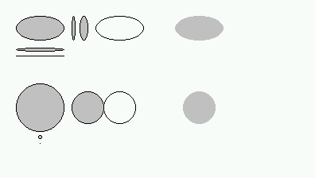
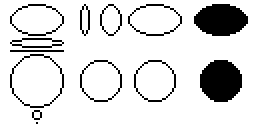
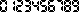
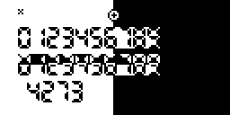
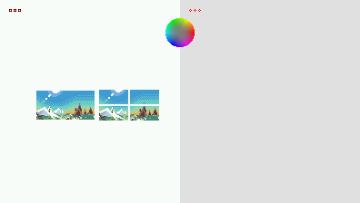

# `gint`: Module d'accès aux fonctionnalités de gint

PythonExtra est écrit à l'aide du [fxSDK](https://gitea.planet-casio.com/Lephenixnoir/fxsdk) et utilise [gint](https://gitea.planet-casio.com/Lephenixnoir/gint) pour exécuter l'add-in. Le module Python `gint` permet d'accéder aux fonctions internes de gint en Python pour le dessin, le clavier, etc. Comme gint possède beaucoup de fonctions utiles avec de bonnes performances, il est intéressant de s'en servir au lieu d'utiliser e.g. `casioplot` ou `turtle`.

Le module `gint` essaie de garder en Python la même API que dans la version originale de la bibliothèque en C, c'est pourquoi peu de fonctions utilisent des arguments nommés ou autres fonctions surchargées. Il y a quelques différences, documentées à la fin de cette page. En cas de doute, la documentation fournie par les [fichiers d'en-tête de gint](https://gitea.planet-casio.com/Lephenixnoir/gint/src/branch/master/include/gint) (les `.h`) est tout à fait applicable pour comprendre les comportements que cette page n'explique pas.

Tous les noms de constantes, fonctions, etc. discutés dans cet article sont dans le module `gint`.

```py
import gint
# ou:
from gint import *
```

**Sommaire**
- [Saisie au clavier](#saisie-au-clavier)
- [Dessin à l'écran](#dessin-à-lécran)
- [Différences avec l'API C de gint](#différences-avec-lapi-c-de-gint)

## Saisie au clavier

Les en-têtes de référence sont [`<gint/keyboard.h>`](https://gitea.planet-casio.com/Lephenixnoir/gint/src/branch/master/include/gint/keyboard.h) et [`<gint/keycodes.h>`](https://gitea.planet-casio.com/Lephenixnoir/gint/src/branch/master/include/gint/keycodes.h).

### Noms des touches

Le module fournit des constantes entières désignant toutes les touches du clavier. Les noms sont les suivants :

|            |            |            |            |            |             |
|------------|------------|------------|------------|------------|-------------|
|`KEY_F1`    |`KEY_F2`    |`KEY_F3`    |`KEY_F4`    |`KEY_F5`    |`KEY_F6`     |
|`KEY_SHIFT` |`KEY_OPTN`  |`KEY_VARS`  |`KEY_MENU`  |`KEY_LEFT`  |`KEY_UP`     |
|`KEY_ALPHA` |`KEY_SQUARE`|`KEY_POWER` |`KEY_EXIT`  |`KEY_DOWN`  |`KEY_RIGHT`  |
|`KEY_XOT`   |`KEY_LOG`   |`KEY_LN`    |`KEY_SIN`   |`KEY_COS`   |`KEY_TAN`    |
|`KEY_FRAC`  |`KEY_FD`    |`KEY_LEFTP` |`KEY_RIGHTP`|`KEY_COMMA` |`KEY_ARROW`  |
|`KEY_7`     |`KEY_8`     |`KEY_9`     |`KEY_DEL`   |`KEY_ACON`  |             |
|`KEY_4`     |`KEY_5`     |`KEY_6`     |`KEY_MUL`   |`KEY_DIV`   |             |
|`KEY_1`     |`KEY_2`     |`KEY_3`     |`KEY_ADD`   |`KEY_SUB`   |             |
|`KEY_0`     |`KEY_DOT`   |`KEY_EXP`   |`KEY_NEG`   |`KEY_EXE`   |             |

### Événements clavier

```
key_event:
  .time  -> int
  .mod   -> bool
  .shift -> bool
  .alpha -> bool
  .type  -> KEYEV_NONE | KEYEV_DOWN | KEYEV_UP | KEYEV_HOLD
  .key   -> KEY_*
```

gint communique les informations sur ce qu'il se passe au clavier via des _événements_. Les événements indiquent quand une touche (champ `.key`) a été pressée, maintenue, ou relâchée (champ `.type` égal à `KEYEV_DOWN`, `KEYEV_HOLD` et `KEYEV_UP` respectivement), quand (champ `.time`) et si des modifieurs (SHIFT ou ALPHA, champs `.shift` et `.alpha`) étaient actifs à ce moment-là.

(Le champ `.mod` n'est pas très intéressant, et la valeur `KEYEV_NONE` de `.type` est discutée dans `pollevent()`.)

Les fonctions `getkey()`, `getekey_opt()`, `pollevent()` et `waitevent()` renvoient toutes des événements.

### Saisie d'une touche avec attente

```py
getkey() -> key_event
```

La fonction `getkey()` met le programme en pause jusqu'à ce qu'une touche soit pressée ou répétée, et renvoie l'événement associé (qui est forcément de type `KEYEV_DOWN` ou `KEYEV_HOLD`). Par défaut, les seules touches qui sont répétées sont les touches directionnelles, une première fois après 400 ms, et ensuite toutes les 40 ms.

Pas mal de choses peuvent se produire pendant l'exécution de `getkey()`. L'utilisateur peut appuyer sur SHIFT ou ALPHA, ce qui affecte les champs `.shift` et `.alpha` de l'événement renvoyé. L'utilisateur peut également se rendre au menu principal avec MENU et éteindre la calculatrice avec SHIFT+AC/ON.

_Exemple._ Dans un menu de sélection de N éléments, on pourrait naviguer avec les touches haut et bas, sauter directement au début ou à la fin avec SHIFT haut et SHIFT bas, et valider avec EXE.

```py
ev = getkey()
if ev.key == KEY_EXE:
    pass       # Valider
elif ev.key == KEY_UP and ev.shift:
    pos = 0    # Revenir au début
elif ev.key == KEY_DOWN and ev.shift:
    pos = N-1  # Aller à la fin
elif ev.key == KEY_UP and pos > 0:
    pos -= 1   # Monter d'une position
elif ev.key == KEY_DOWN and pos < N-1:
    pos += 1   # Descendre d'une position
```

TODO: Parler de `getkey_opt()`

### Lecture des événements en temps réel

```py
pollevent() -> key_event
waitevent() -> key_event
clearevents() -> None
```

gint enregistre l'activité du clavier en tâche de fond pendant que le programme s'exécute. Les événements sont mis dans une file d'attente jusqu'à ce que le programme les lise. C'est comme ça par exemple que `getkey()` détermine quoi renvoyer.

Il est possible d'accéder aux événements directement à l'aide de la fonction `pollevent()`. `pollevent()` renvoie l'événement le plus ancien qui n'a pas encore été lu par le programme. Si le programme a lu tous les événements et qu'il n'y a plus rien en attente, `pollevent()` renvoie un "faux" évenement de type `KEYEV_NONE` pour indiquer qu'il n'y a plus rien à lire.

Comme `pollevent()` retourne instanténement, on peut s'en servir pour lire l'activité du clavier sans mettre le programme en pause.

_Exemple._ Une boucle de jeu pourrait, à chaque frame, lire tous les événements en attente pour déterminer quand le joueur appuie sur la touche SHIFT ("action" dans cet exemple) pour déclencher une action.

```py
# Dessiner le jeu...

while True:
    ev = pollevent()
    if ev.type == KEYEV_NONE:
        break  # Fin de la lecture des événements
    if ev.type == KEYEV_DOWN and ev.key == KEY_SHIFT:
        pass   # La touche SHIFT vient d'être pressée !
    # Ignore implicitement les autres touches

# Simuler le jeu...
```

La fonction `waitevent()` est similaire, mais si tous les événements ont été lus elle attend qu'un événement se produise avant de retourner. Elle est plus rarement utilisée parce qu'en général quand on veut attendre on utilise `getkey()`.

La fonction `clearevents()` lit et ignore tous les événements, i.e. elle "jette" toutes les informations sur ce qu'il s'est passé au clavier. Elle est utile pour connaître l'état instantané du clavier avec `keydown()` (voir ci-dessous). `clearevents()` est équivalente à la définition suivante :

```py
def clearevents():
    ev = pollevent()
    while ev.type != KEYEV_NONE:
        ev = pollevent()
```

### Lecture de l'état instantané du clavier

```py
keydown(key: int) -> bool
keydown_all(*keys: [int]) -> bool
keydown_any(*keys: [int]) -> bool
```

Une fois les événements lus, on peut tester individuellement si les touches sont pressées ou pas à l'aide de la fonction `keydown()`. `keydown(k)` renvoie `True` si la touche `k` est pressée, `False` sinon. Cette fonction ne marche **que si les événements ont été lus**, ce qu'on fait souvent soit avec `pollevent()` soit avec `clearevents()`.

_Exemple._ Une boucle de jeu pourrait tester si les touches gauche/droite sont pressées à chaque frame pour déplacer le joueur.

```py
while True:
    ev = pollevent()
    # ... comme dans l'exemple pollevent()

if keydown(KEY_LEFT):
    player_x -= 1
if keydown(KEY_RIGHT):
    player_x += 1
```

La fonction `keydown_all()` prent une série de touches en paramètre et renvoie `True` si elles sout toutes pressées. `keydown_any()` est similaire et renvoie `True` si au moins une des touches listées est pressée.

### Lecture rapide des changements de position des touches

```py
cleareventflips() -> None
keypressed(key: int) -> bool
keyreleased(key: int) -> bool
```

`keydown()` indique uniquement l'état instantané des touches. Elle ne permet pas de déterminer à quel moment une touche passe de l'état relâché à l'état pressé ou l'inverse. Pour ça, il faut soit utiliser les événements (ce qui est un peu lourd), soit se souvenir de quelles touches étaient pressées à "l'instant" précédent, soit utiliser les fonctions ci-dessous.

Les fonctions `keypressed(k)` et `keyreleased(k)` indiquent si la touche a été pressée/relâchée depuis le dernier appel à `cleareventflips()`. Attention la notion de "pressée/relâchée" ici n'est pas le temps réel mais la lecture des événements.

_Exemple._ Une boucle de jeu peut tester à la fois l'état immédiat et les changements d'état des touches en utilisant les fonctions instantanée après `cleareventflips()` suivi de `clearevents()`.

```py
# Dessiner le jeu...

cleareventflips()
clearevents()

if keypressed(KEY_SHIFT):
    pass # Action !
if keydown(KEY_LEFT):
    player_x -= 1
if keydown(KEY_RIGHT):
    player_x += 1

# Simuler le jeu...
```

### Fonctions diverses concernant le clavier

```py
keycode_function(key: int) -> int
keycode_digit(key: int) -> int
```

`keycode_function(k)` renvoie le numéro de F-touche de `k` (i.e. 1 pour `KEY_F1`, 2 pour `KEY_F2`, etc.) et -1 pour les autres touches.

`keycode_digit(k)` renvoie le chiffre associé à `k` (i.e. 0 pour `KEY_0`, 1 pour `KEY_1`, etc.) et -1 pour les autres touches.

## Dessin à l'écran

Les en-têtes de référence sont [`<gint/display.h>`](https://gitea.planet-casio.com/Lephenixnoir/gint/src/branch/master/include/gint/display.h), et pour certains détails techniques [`<gint/display-fx.h>`](https://gitea.planet-casio.com/Lephenixnoir/gint/src/branch/master/include/gint/display-fx.h) et [`<gint/display-cg.h>`](https://gitea.planet-casio.com/Lephenixnoir/gint/src/branch/master/include/gint/display-cg.h).

### Manipulation de couleurs

```py
C_WHITE: int    # Blanc
C_BLACK: int    # Noir
C_LIGHT: int    # Gris clair (sur mono: moteur de gris)
C_DARK: int     # Gris foncé (sur mono: moteur de gris)
C_NONE: int     # Transparent
C_INVERT: int   # Inverseur de couleur

# Graph mono uniquement :
C_LIGHTEN: int  # Éclaircisseur de couleur (moteur de gris)
C_DARKEN: int   # Assombrisseur de couleur (moteur de gris)

# Graph 90+E uniquement :
C_RED: int      # Rouge pur
C_GREEN: int    # Vert pur
C_BLUE: int     # Bleu pur
C_RGB(r: int, g: int, b: int) -> int
```

Les couleurs sont toutes des nombres entiers (manipuler des tuples `(r,g,b)` est atrocement lent par comparaison et requiert des allocations mémoire dans tous les sens). Une poignée de couleurs est fournie par défaut.

Sur Graph 90+E, la fonction `C_RGB()` peut être utilisée pour créer des couleurs à partir de trois composantes de valeur 0 à 31.

TODO: Expliquer le moteur de gris.

### Fonctions de dessin basiques

```py
DWIDTH: int
DHEIGHT: int
dupdate() -> None
dclear(color: int) -> None
dpixel(x: int, y: int, color: int) -> None
dgetpixel(x: int, y: int) -> int
```

Les entiers `DWIDTH` et `DHEIGHT` indiquent la taille de l'écran. C'est 128x64 sur les Graph mono (type Graph 35+E II), 396x224 sur la Prizm et Graph 90+E (le plein écran est disponible).

Toutes les fonctions de dessin opèrent sur une image interne appellée "VRAM" ; l'effet du dessin n'est donc pas visible immédiatement à l'écran. Pour que le dessin se voie il faut appeler la fonction `dupdate()` qui transfère les contenus de la VRAM à l'écran réel. Généralement, on fait ça après avoir affiché tout ce dont on a besoin et pas après chaque appel de fonction de dessin.

Dans PythonExtra, la fonction `dupdate()` indique aussi implicitement qu'on « passe en mode graphique ». À cause de certaines optimisations tout appel à `print()` est considéré comme un « passage en mode texte » et pendant qu'on est en mode texte le shell peut redessiner à tout moment. Si on veut dessiner après avoir utilisé le mode texte, il faut appeler `dupdate()` pour forcer un passage en mode graphique avant de commencer à dessiner. Sinon le dessin du shell pourrait interférer avec le dessin du programme.

La fonction `dclear()` remplit l'écran d'une couleur unie.

La fonction `dpixel()` modifie la couleur d'un pixel. Les coordonnées, comme pour toutes les fonctions de dessin, sont (x,y) où `x` varie entre 0 et DWIDTH-1 inclus (0 étant à gauche), et `y` varie entre 0 et DHEIGHT-1 inclus (0 étant en haut).

La fonction `dgetpixel()` renvoie la couleur d'un pixel. Attention, `dgetpixel()` lit dans la VRAM, pas sur l'écran.

_Exemple ([`ex_draw1.py`](../../sh/ports/examples/ex_draw1.py))._

```py
from gint import *
dclear(C_WHITE)
for y in range(10):
    for x in range(10):
        if (x^y) & 1:
            dpixel(x, y, C_BLACK)
dupdate()
```

 

### Fonctions de dessin de formes géométriques

```py
drect(x1: int, y1: int, x2: int, y2: int, color: int) -> None
drect_border(x1: int, y1: int, x2: int, y2: int, fill_color: int,
             border_width: int, border_color: int) -> None
dline(x1: int, y1: int, x2: int, y2: int, color: int) -> None
dhline(y: int, color: int) -> None
dvline(x: int, color: int) -> None
dcircle(x: int, y: int, radius: int, fill_color: int,
        border_color: int) -> None
dellipse(x1: int, y1: int, x2: int, y2: int, fill_color: int,
        border_color: int) -> None
```

`drect()` dessine un rectangle plein allant de (x1, y1) à (x2, y2) (tous les deux inclus). L'ordre des points ne compte pas, i.e. x1 ≥ x2 ou y1 ≥ y2 est autorisé.

`drect_border()` est similaire mais dessine une bordure de largeur `border_width` et de couleur `border_color`. La bordure est dessinée _à l'intérieur_ du rectangle.

`dline()` dessine une ligne droite entre les points (x1, y1) et (x2, y2). Les raccourcis `dhline()` et `dvline()` dessinent respectivement une ligne horizontale et verticale à travers tout l'écran.

`dcircle()` dessine un cercle défini par son centre et rayon avec l'algorithme de Bresenham. La couleur de l'intérieur et du bord peuvent être spécifiées séparément, y compris avec `C_NONE` (transparente). Par construction, `dcircle()` ne peut construire que des cercles de diamètre impair ; pour les diamètres plus fin, utilisez `dellipse()`.

`dellipse()` dessine une ellipse définie par son rectangle englobant. Les points (x1, y1) et (x2, y2) sont tous les deux inclus dans le rectangle. Pour dessiner une ellipse à partir de son centre (x, y) et de ses demi-grand/petit axes a/b, utilisez `dellipse(x-a, y-b, x+a, y+b, fill_color, border_color)`.

TODO: Exemple pour `drect()`, `drect_border()`, `dline()`.

_Exemple ([`ex_circle.py`](../../sh/ports/examples/ex_circle.py))._

 

### Fonctions de dessin d'images

```py
dimage(x: int, y: int, img: image) -> None
dsubimage(x: int, y: int, img: image, left: int, top: int, width: int, height: int) -> None
```

**Sur Graph mono**

```py
image:
  .profile -> IMAGE_MONO | ...
  .width   -> int
  .height  -> int
  .data    -> buffer-like

# Constructeur
image(profile: IMAGE_*, width: int, height: int, data: buffer-like) -> image
```

Les images sur Graph mono sont en noir-et-blanc ou 4 couleurs (quand le moteur de gris est utilisé). Chaque image a un champ `.profile` indiquant le format d'image (le nom "profile" est hérité d'anciennes versions de gint), deux champs `.width` et `.height` indiquant sa taille, et un champ `.data` donnant accès aux données brutes.

Les quatre formats disponibles sont les suivants.

| Format             | Couleurs                         | Calques | Nom dans fxconv |
|--------------------|----------------------------------|---------|-----------------|
| `IMAGE_MONO`       | Noir/blanc (2)                   | 1       | `mono`          |
| `IMAGE_MONO_ALPHA` | Noir/blanc, transparent (3)      | 2       | `mono_alpha`    |
| `IMAGE_GRAY`       | Niveaux de gris (4)              | 2       | `gray`          |
| `IMAGE_GRAY_ALPHA` | Niveaux de gris, transparent (5) | 3       | `gray_alpha`    |

Le format des données brutes est un peu compliqué. L'image est stockée ligne par ligne de haut en bas ; chaque ligne est représentée de gauche à droite par une série de mots représentant chacun 32 pixels. Chaque mot contient un bit par pixel (sous la forme d'un entier de 4 octets) pour chaque calque.

Le plus simple pour obtenir une image est de générer le code associé avec l'outil fxconv du [fxSDK](https://gitea.planet-casio.com/Lephenixnoir/fxsdk). Les options `--bopti-image-fx --fx` spécifient qu'on convertit une image pour Graph mono et la métadonnée `profile:mono` choisit le format de l'image produite. Le tableau ci-dessus liste la valeur de `profile:` à spécifier pour chaque format. Par exemple pour l'image [`fx_image_7seg.py`](../../ports/sh/examples/fx_image_7seg.png) :



```bash
% fxconv --bopti-image fx_image_7seg.png -o 7seg.py --fx profile:mono name:seg --py
```
```py
import gint
seg = gint.image(0, 79, 12, b'|\x00||\x00|||||\x00\x00\xba\x02::\x82\xb8\xb8:\xba\xba\x00\x00\xc6\x06\x06\x06\xc6\xc0\xc0\x06\xc6\xc6\x00\x00\xc6\x06\x06\x06\xc6\xc0\xc0\x06\xc6\xc6\x00\x00\x82\x02\x02\x02\x82\x80\x80\x02\x82\x82\x00\x00\x00\x00|||||\x00||\x00\x00\x82\x02\xb8:::\xba\x02\xba:\x00\x00\xc6\x06\xc0\x06\x06\x06\xc6\x06\xc6\x06\x00\x00\xc6\x06\xc0\x06\x06\x06\xc6\x06\xc6\x06\x00\x00\xc6\x06\xc0\x06\x06\x06\xc6\x06\xc6\x06\x00\x00\xba\x02\xb8:\x02:\xba\x02\xba:\x00\x00|\x00||\x00||\x00||\x00\x00')
```
L'option `--py-compact` permet de générer du code beaucoup plus compact (avec moins de `\x`), par contre le fichier obtenu ne peut pas être lu par un éditeur de texte. La seule option simple pour l'utiliser est de l'envoyer sur la calculatrice et l'importer tel quel (on peut aussi le manipuler avec un programme).

La fonction `dimage()` dessine une image à l'écran en positionnant le coin haut gauche de l'image à la position (x, y).

La fonction `dsubimage()` permet de dessiner un sous-rectangle d'une image. Le sous-rectangle commence à la position (left, top) de l'image et s'étend sur une largeur `width` et une hauteur `height`. Le sous-rectangle est dessiné de façon à ce que le pixel (left, top) arrive à la position (x, y) de l'écran.

_Exemple ([`fx_image.py`](../../ports/sh/examples/fx_image.py))._



**Sur Graph couleur**

```py
image:
  .format      -> IMAGE_RGB565 | ...
  .flags       -> int
  .color_count -> int
  .width       -> int
  .height      -> int
  .stride      -> int
  .data        -> buffer-like
  .palette     -> buffer-like

# Constructeur
image(format: IMAGE_*, color_count: int, width: int, height: int, stride: int, data: buffer-like, palette: buffer-like) -> image

# Constructeurs spécialisés par format
image_rgb565(width: int, height: int, data: buffer-like) -> image
image_rgb565a(width: int, height: int, data: buffer-like) -> image
image_p8_rgb565(width: int, height: int, data: buffer-like, palette: buffer-like) -> image
image_p8_rgb565a(width: int, height: int, data: buffer-like, palette: buffer-like) -> image
image_p4_rgb565(width: int, height: int, data: buffer-like, palette: buffer-like) -> image
image_p4_rgb565a(width: int, height: int, data: buffer-like, palette: buffer-like) -> image
```

Les images sur Graph couleur sont déclinées en différents formats indiqués par le champ `.format`, dont les valeurs possibles sont listées ci-dessous. Les différences sont dans le nombre de couleurs, la présence ou pas de transparence, et la présence ou pas d'une palette de couleurs. Bien sûr, moins il y a de couleurs moins l'image prend de place en mémoire, donc de façon générale il est très bénéfique d'utiliser le plus petit format possible pour chaque image.

| Format             | Couleurs            | Palette     | Nom dans fxconv |
|--------------------|---------------------|-------------|-----------------|
| `IMAGE_RGB565`     | 65536               | Non         | `rgb565`        |
| `IMAGE_RGB565A`    | 65535 + transparent | Non         | `rgb565a`       |
| `IMAGE_P8_RGB565`  | 256                 | Oui (1-256) | `p8_rgb565`     |
| `IMAGE_P8_RGB565A` | 255 + transparent   | Oui (1-256) | `p8_rgb565a`    |
| `IMAGE_P4_RGB565`  | 16                  | Oui (16)    | `p4_rgb565`     |
| `IMAGE_P4_RGB565A` | 15 + transparent    | Oui (16)    | `p4_rgb565a`    |

Le champ `.color_count` indique le nombre de couleurs dans la palette quand il y en a une. Pour les formats P8 ce nombre varie entre 1 et 256, pour les formats P4 il est toujours égal à 16. Les deux champs `.width` et `.height` indiquent la taille de l'image. Enfin, les champs `.data` et `.palette` permettent d'accéder aux données brutes des pixels ainsi que de la palette.

(Le champ `.flags` est un détail de gestion de mémoire qui ne devrait pas importer aux scripts Python. Le champ `.stride` indique combien d'octets séparent chaque ligne de pixels dans `.data` et sera de même rarement utilisé.)

Les fonctions `dimage()` et `dsubimage()` ont le même fonctionnement que pour les Graph mono ; voir ci-dessus.

Comme pour Graph mono les images peuvent être converties avec fxconv. Par exemple pour l'image [`cg_image_puzzle.png`](../../ports/sh/examples/cg_image_puzzle.png)


```bash
% fxconv --bopti-image cg_image_puzzle.png -o puzzle.py --cg profile:p4_rgb565 name:puzzle --py
```
```py
import gint
puzzle = gint.image(6, 16, 64, 32, 32,
    b'\xbb\xbb\xbb\xbb\xbb ... \xdd\xdd\xdd\xdd\xdd\xdd\xdd',
    b'\xff\xff\xcfW\x86\xd8\xbe|\xceP\xe5\x8a\x963f9u\x9c}\xa8\x9dxD\xfa\x83\xceLNZ\xcci\xa7')
```
L'option `--py-compact` est recommandée pour réduire la taille du code ; voir les détails dans la section Graph mono.

_Exemple ([`cg_image.py`](../../ports/sh/examples/cg_image.py))._



## Différences avec l'API C de gint

- `dsubimage()` n'a pas de paramètre `int flags`. Les flags en question ne ont que des optimisations mineures et pourraient disparaître dans une version future de gint.
- Les constructeurs d'image `image()` et `image_<format>()` n'existent pas dans l'API C.
- Les timeouts asynchrones à base d'entiers volatiles sont remplacés par des timeouts synchrones avec des durées optionnelles en millisecondes (entier ou `None`).

TODO : Il y en a d'autres.
